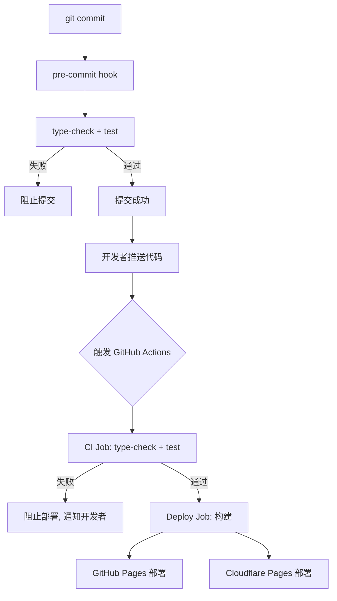

## 用户需求

为 json-crypto 项目（Vue 3 + TypeScript SPA）建立完整的后期部署体系，包含以下 5 个方面：

1. **Git 提交前自测**：通过 Git hooks（husky + lint-staged）在 `git commit` 前自动运行类型检查和单元测试，确保代码质量
2. **推送 main 分支后自动部署**：通过 GitHub Actions 实现 push 到 main 分支后自动构建和部署
3. **双平台部署**：

- **GitHub Pages**：自动部署，需配置 base 路径和 SPA 404 回退
- **Cloudflare Pages**：自动部署，根路径部署，需配置 SPA 回退

4. **部署脚本**：提供手动部署脚本（deploy-github.sh、deploy-cloudflare.sh）及通用构建脚本
5. **更新 README**：根据项目当前已实现的全部功能（主题切换、批量处理、文件筛选搜索、264 个测试用例等）更新完善项目文档，补充部署指南

## 产品概述

json-crypto 是一个 JSON 数据处理工具，支持 JSON 格式化、压缩、6 种算法加密解密、文件管理、批量处理、主题切换等功能，目前有 12 个测试文件、264 个用例、约 90% 覆盖率，但缺少任何 CI/CD 配置和部署基础设施。

## 核心特性

- 提交前强制检查：类型检查 + 单元测试通过才允许 commit
- CI/CD 流水线：push main -> 自动测试 -> 自动构建 -> 双平台部署
- GitHub Pages 部署：配置 base 路径为 /json-crypto/，包含 404.html SPA 回退
- Cloudflare Pages 部署：根路径部署，通过 _redirects 文件实现 SPA 回退
- 手动部署脚本：独立的 shell 脚本便于手动触发部署
- README 完善：补全功能列表、测试信息、部署指南

## 技术栈

- **包管理器**：pnpm@10.32.1
- **构建工具**：Vite 5.4
- **前端框架**：Vue 3 + TypeScript
- **测试框架**：Vitest 3.2 + @vue/test-utils + happy-dom
- **Git Hooks**：husky + lint-staged
- **CI/CD**：GitHub Actions
- **部署目标**：GitHub Pages + Cloudflare Pages

## 实现方案

### 1. Git 提交前自测

**策略**：使用 husky 配置 pre-commit hook，在 commit 前运行 `pnpm run type-check` 和 `pnpm run test`。

**关键决策**：

- 不使用 lint-staged（项目无 ESLint/Prettier），直接在 pre-commit 中运行全量检查
- type-check 通过 `vue-tsc -b` 执行，test 通过 `vitest run` 执行
- 测试超时设置合理阈值，避免等待过长

**性能考量**：

- `vue-tsc -b` 约 5-10 秒（增量编译）
- `vitest run` 约 3-4 秒（264 个用例）
- 总计 pre-commit 约 8-14 秒，可接受

### 2. GitHub Actions 自动构建部署

**策略**：创建单个 workflow 文件，包含 ci（测试）和 deploy 两个 job：

- **ci job**：每次 push/PR 触发，运行 type-check + test
- **deploy job**：仅在 push main 时触发，ci 通过后构建并部署

**部署实现**：

- **GitHub Pages**：使用 `actions/deploy-pages`，构建时需根据仓库名设置 VITE_BASE 环境变量
- **Cloudflare Pages**：使用 `cloudflare/pages-action`，通过 API token 认证

**关键技术细节**：

- GitHub Pages 需要配置 base 路径（如 `/json-crypto/`），通过 `VITE_BASE` 环境变量动态设置
- Cloudflare Pages 部署到根路径，base 默认 `/`
- 两平台都需要 SPA 回退：GitHub Pages 通过 404.html，Cloudflare Pages 通过 _redirects

### 3. 构建配置调整

**vite.config.ts 修改**：

- 添加 `base` 配置，读取 `process.env.VITE_BASE || '/'`
- 确保资源引用路径正确

**SPA 回退**：

- 在 `public/` 目录下添加 `404.html`（GitHub Pages 专用，内容与 index.html 相同）
- 在 `public/` 目录下添加 `_redirects`（Cloudflare Pages 专用，内容为 `/* /index.html 200`）

### 4. 部署脚本

提供以下脚本：

- `scripts/deploy-setup.sh`：安装 husky、初始化 git hooks
- `scripts/build-and-preview.sh`：本地构建 + 预览
- `scripts/deploy-github.sh`：手动构建并推送 GitHub Pages
- `scripts/deploy-cloudflare.sh`：手动构建并部署 Cloudflare Pages

### 5. README 更新

根据当前已实现的完整功能列表更新 README，补充：

- 主题切换功能
- 批量处理带进度条
- 文件筛选和搜索
- 加引号选项
- 处理页面添加文件
- 完整的测试覆盖信息
- 详细的部署指南（GitHub Pages + Cloudflare Pages + 手动部署）
- 项目架构图

## 实现说明

- **向后兼容**：所有现有功能不受影响，仅新增 CI/CD 和部署配置
- **安全**：GitHub Actions secrets 用于存储 API tokens，不硬编码
- **最小改动**：vite.config.ts 仅添加一行 base 配置，其余为新增文件

## 架构设计



## 目录结构

```
json-crypto/
├── .github/
│   └── workflows/
│       └── deploy.yml           # [NEW] CI/CD 工作流，包含测试和双平台部署
├── scripts/
│   ├── deploy-setup.sh          # [NEW] 初始化部署环境（安装 husky、配置 git hooks）
│   ├── build-and-preview.sh     # [NEW] 本地构建 + 预览脚本
│   ├── deploy-github.sh         # [NEW] 手动部署 GitHub Pages 脚本
│   └── deploy-cloudflare.sh     # [NEW] 手动部署 Cloudflare Pages 脚本
├── public/
│   ├── 404.html                 # [NEW] GitHub Pages SPA 回退页（复制 index.html）
│   └── _redirects               # [NEW] Cloudflare Pages SPA 回退规则
├── vite.config.ts               # [MODIFY] 添加 base 配置，支持环境变量动态设置
├── package.json                 # [MODIFY] 添加 prepare script 和 husky 依赖
├── README.md                    # [MODIFY] 全面更新，补全功能列表和部署指南
├── .husky/
│   └── pre-commit               # [NEW] Git pre-commit hook，运行 type-check + test
└── docs/
    └── deployment-guide.md      # [NEW] 详细部署指南文档
```

## 关键代码结构

**vite.config.ts base 配置**：

```typescript
base: process.env.VITE_BASE || '/',
```

**GitHub Actions deploy.yml 关键结构**：

- 触发条件：push main + pull_request main
- ci job：pnpm install -> type-check -> test
- deploy-github job：build (VITE_BASE=/${{ github.event.repository.name }}/) -> upload artifact -> deploy pages
- deploy-cloudflare job：build -> deploy with cloudflare/pages-action

**public/404.html**：与 index.html 完全相同，GitHub Pages 在 404 时返回此文件实现 SPA 回退。

**public/_redirects**：`/* /index.html 200`，Cloudflare Pages 的 SPA 回退规则。

## Agent Extensions

### Skill

- **github**
- Purpose: 用于验证 GitHub Actions 工作流配置的语法正确性，以及后续在 GitHub 上创建必要的 secrets（CLOUDFLARE_API_TOKEN、CLOUDFLARE_ACCOUNT_ID）
- Expected outcome: 确保工作流配置有效，仓库 secrets 正确设置