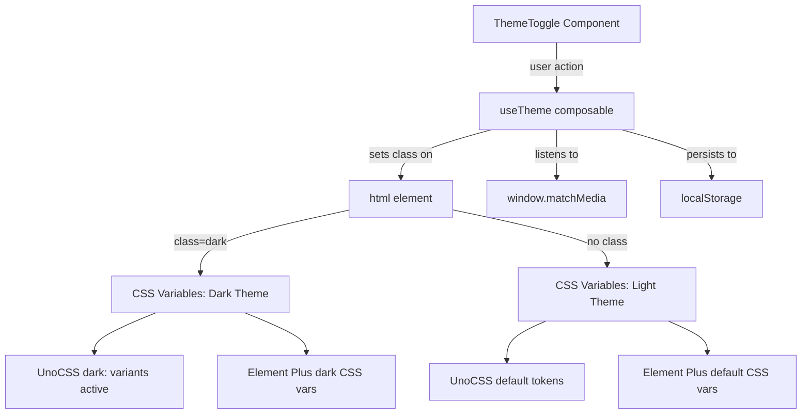

## User Requirements

为 JSON Crypto 工具实现完整的换肤功能，支持三种主题模式：

1. **暗黑模式**：基于当前已有的暗黑风格进行优化，确保所有页面和弹框风格统一为暗黑模式
2. **亮色模式**：全新设计，覆盖所有页面和弹框，风格偏蓝色调
3. **跟随系统**：自动匹配操作系统的 prefers-color-scheme 设置

## Core Features

- 主题状态管理：暗黑 / 亮色 / 跟随系统三种模式切换
- 主题持久化：用户选择的主题偏好保存到 localStorage
- 系统主题监听：跟随系统模式下实时响应操作系统主题变更
- UnoCSS `dark:` 变体适配：利用已有的 UnoCSS `dark: 'class'` 策略实现组件级双主题
- Element Plus 深度样式覆盖：输入框、下拉框、复选框、单选框组、弹框、进度条等组件在两种主题下均有正确样式
- 全局 CSS 变量体系：通过 CSS 自定义属性管理主题色，`<html>` 或 `:root` 上的类名驱动变量切换
- 主题切换 UI：页面中提供可视化的主题切换控件

## Tech Stack

- Vue 3 + TypeScript (项目现有技术栈)
- UnoCSS `dark: 'class'` (已在 `uno.config.ts` 中配置)
- Element Plus CSS 变量覆盖 (已在 `style.css` 中使用 `--el-*` 变量)
- localStorage 主题持久化

## Implementation Approach

### 核心策略

利用项目已有的 UnoCSS `dark: 'class'` 配置 + Element Plus CSS 变量体系，通过在 `<html>` 元素上切换 `dark` class 实现主题切换。所有颜色值从硬编码迁移到 CSS 变量，`light` 变量作为默认值，`dark` class 下覆盖为暗黑值。

### 为什么选择这个方案

- **最小改动量**：UnoCSS 已经配置了 `dark: 'class'` 模式，无需额外配置
- **Element Plus 原生支持**：Element Plus 提供 `dark` CSS 变量集，通过 `@import 'element-plus/theme-chalk/dark/css-vars.css'` 即可启用
- **性能最优**：class 切换比 CSS 媒体查询更容易与 JS 状态同步，且支持手动覆盖
- **持久化简单**：localStorage 存储用户偏好，跟随系统模式通过 `matchMedia` 监听

### 性能与可靠性

- 主题切换为同步 class 替换，无闪烁（composable 在 `main.ts` 最早期调用）
- `matchMedia` 监听器在组件卸载时清理，无内存泄漏
- localStorage 读取仅在应用初始化时执行一次
- 所有样式覆盖使用 CSS 变量继承，无 JS 运行时样式计算

## Implementation Notes

- **闪烁控制**：`useTheme()` 必须在 `main.ts` 中 app 挂载前调用，确保首次渲染前已设置 class
- **Element Plus 暗黑变量**：使用官方提供的 `element-plus/theme-chalk/dark/css-vars.css`，而非手动覆盖每个变量
- **对话框 Teleport**：Element Plus 弹框默认 teleport 到 `<body>`，全局样式即可覆盖；但 `el-select-dropdown` 需要 `.el-popper` 级别的样式覆盖
- **CSS 变量命名**：项目级变量使用 `--app-*` 前缀，避免与 Element Plus `--el-*` 冲突
- **向后兼容**：UnoCSS 的 `dark` 颜色 token（`dark-bg`/`dark-card`/`dark-border`）重命名为语义化名称（`bg`/`card`/`border`），通过 CSS 变量映射保持一致
- **Scoped 样式**：组件内 `:deep()` 覆盖 Element Plus 样式时，需要同时写 light 和 dark 两种状态

## Architecture Design

### 主题系统架构



### 数据流

用户点击切换 -> `useTheme` 更新 localStorage -> 设置/移除 `<html class="dark">` -> CSS 变量切换 -> 所有组件响应新主题

## Directory Structure

```
src/
├── composables/
│   └── useTheme.ts             # [NEW] 主题管理 composable：状态管理、class 切换、系统监听、localStorage 持久化
├── components/
│   ├── ThemeToggle.vue         # [NEW] 主题切换 UI 组件：暗黑/亮色/跟随系统三种模式的下拉选择
│   ├── CryptoConfig.vue        # [MODIFY] el-select/el-radio-group/input 样式双主题适配，移除硬编码暗黑色值
│   ├── FileList.vue            # [MODIFY] native select/input 元素双主题适配，使用 CSS 变量替换硬编码色值
│   ├── BatchAction.vue         # [MODIFY] checkbox 样式双主题适配
│   ├── JsonEditor.vue          # [MODIFY] textarea 颜色双主题适配
│   └── ToolBar.vue             # [MODIFY] 最小改动，按钮渐变色天然适配双主题
├── views/
│   ├── UploadView.vue          # [MODIFY] 引入 ThemeToggle、清理硬编码暗黑颜色、使用 UnoCSS dark: 变体
│   └── ProcessView.vue         # [MODIFY] 引入 ThemeToggle、header 区域布局适配、清理硬编码暗黑颜色
├── style.css                   # [MODIFY] 重构为 light 默认 + dark 覆盖的 CSS 变量体系、移除硬编码暗黑色
├── uno.config.ts               # [MODIFY] 颜色 token 重命名（dark-bg -> bg）+ 添加 CSS 变量映射
├── main.ts                     # [MODIFY] 初始化 useTheme、导入 Element Plus 暗黑变量 CSS
└── App.vue                     # [MODIFY] 可选：如需全局 class 绑定
```

## Key Code Structures

```typescript
// useTheme.ts - 核心接口
export type ThemeMode = 'dark' | 'light' | 'system'
export type ResolvedTheme = 'dark' | 'light'

export function useTheme() {
  const mode: Ref<ThemeMode>        // 用户选择的模式
  const resolvedTheme: ComputedRef<ResolvedTheme>  // 实际生效的主题
  function init(): void             // 初始化：读取 localStorage + 应用 class
  function setMode(mode: ThemeMode): void  // 切换模式
  function dispose(): void          // 清理 matchMedia 监听器
}
```

```css
/* style.css - CSS 变量结构示意 */
:root {
  --app-bg: #F0F5FF;
  --app-card: #FFFFFF;
  --app-border: #D0DBEE;
  --app-text-primary: #1A2A4A;
  --app-text-regular: #4A5568;
}
:root.dark {
  --app-bg: #1A1A24;
  --app-card: #252535;
  --app-border: #3A3A4A;
  --app-text-primary: #FFFFFF;
  --app-text-regular: #B8B8C8;
}
```